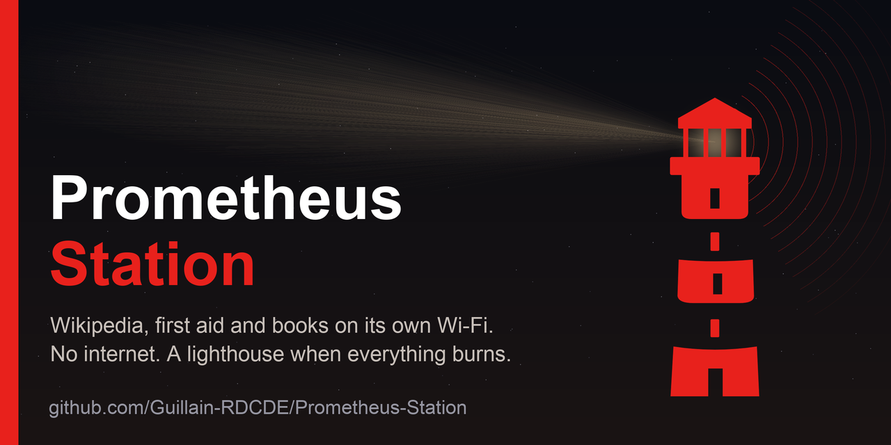
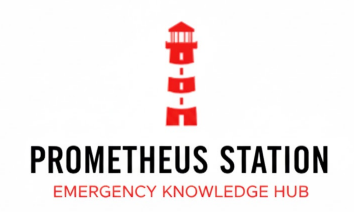

# 
### 🔥 A lighthouse when everything burns

<!-- opening -->
> A battery-powered box that serves all of Wikipedia with no internet and no network at all.
>
> A Raspberry Pi with offline Wikipedia, medical and repair references, books and a message board, on its own Wi-Fi; solar power and mesh radio come next; a build anyone can repeat.
>
> Designed for the day the infrastructure isn’t there. Part of the work of [Guillain d’Erceville](https://github.com/Guillain-RDCDE), forward deployed engineer.
<!-- opening -->

---

## The vision

When civilization's infrastructure collapses—whether by earthquake, war, censorship, or chaos—knowledge becomes the foundation for survival and rebuilding.

**Prometheus Station is a seed vault for human knowledge.**

A self-sufficient knowledge hub that works when the internet doesn't. When cell towers are rubble. When libraries are ash. When asking Google isn't an option.

This is more than emergency medicine. It's the collective wisdom needed to rebuild: how to purify water, grow food, generate power, treat illness, educate children, and maintain the thin veneer we call civilization.

**No internet. No monthly fees. No dependency on infrastructure that can fail.**

Just the accumulated knowledge of humanity, ready to restart civilization from scratch if needed.

---

## 🛠️ Build your own

**[Step-by-step build guide](docs/README.md)** — written for people who have never used Linux: from an empty memory card to a working station, every command given in full, every check shown.

- **[Hardware](HARDWARE.md)** — what it is made of, why, and what it costs.
- **[Reference](docs/REFERENCE.md)** — what is inside, how it works, and the project status.

**Status (October 2026):** the knowledge station works and passed its crisis test (on battery, phone in airplane mode, no internet). Solar power and Meshtastic long-range radio are the next phases.

## 🏥 Medical disclaimer

**Critical notice:**

Medical content provided by Prometheus Station is for **reference and educational purposes only**.

- ✅ Use for field reference when professional care unavailable
- ✅ Training and education for medics and first responders
- ✅ Emergency preparedness planning
- ❌ NOT for self-diagnosis or self-treatment
- ❌ NOT a replacement for qualified medical professionals

**In emergencies:** Seek professional medical help when available. This system is a lifeline when nothing else exists, not a replacement for proper medical care.

Medical content comes from MDWiki, WikEM and Wikipedia, through Kiwix. Verify critical information from multiple sources.

---

## 📜 License

**MIT License**

Copyright © 2025 Guillain d'Erceville

**What this means:**
- ✅ Use freely for any purpose
- ✅ Modify and adapt to your needs
- ✅ Deploy in disaster zones without asking
- ✅ Build commercial products (though why?)
- ✅ Share and distribute
- ❌ Don't blame me if it achieves sentience

**Special grant to humanitarian organizations:**

MSF, ICRC, Red Cross, and all humanitarian organizations: You have explicit permission to use, modify, and deploy this system **without attribution requirements**. Save lives first. Credit never.

---

## 🙏 Standing on shoulders of giants

**This exists because of:**

- **[Kiwix](https://www.kiwix.org)** - Making offline knowledge possible
- **[Meshtastic](https://meshtastic.org)** - Resilient mesh communication
- **[Raspberry Pi Foundation](https://www.raspberrypi.org)** - Accessible computing
- **Wikipedia contributors** - Humanity's knowledge, freely shared
- **MDWiki, WikEM, iFixit, Project Gutenberg** - Medicine, repairs and books, freely shared
- **Open-source community** - Collective brilliance
- **Emergency responders worldwide** - Inspiration and purpose

---

## 📞 Contact & community

- **GitHub:** [@Guillain-RDCDE](https://github.com/Guillain-RDCDE)
- **Issues:** [Report problems or suggest improvements](https://github.com/Guillain-RDCDE/Prometheus-Station/issues)

**If you build this, share your experience.** Every deployment teaches us something.

---
